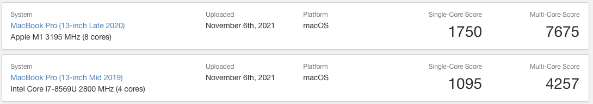

<!--truncate-->
## 디자인

__자료출처: [애플 공식 홈페이지](https://www.apple.com/kr/shop/buy-mac/macbook-pro/13형-스페이스-그레이-apple-m1-칩(8코어-cpu-및-8코어-gpu)-512gb#)__

## 성능
전 세대 보다 현저하게 낮은 발열 덕에 스로틀을 경험하기 힘들다.  m1 네이티브하게 빌드환경을 구성하면 소요 사간 차이를 확실하게 느낄 수 있다.

xcode 아카이브 정도는 되어야 팬이 돌아간다.  이때 CPU 모니터 상으로 최고 온도는 100도 가까이 올라가지만 열 패키징이 잘 되었는지 팜레스트나 하우징으로 전달되지 않는것 같다. 상당히 쾌적하다.

m1 을 네이티브하게 지원하는 프로그램들은 확실히 놀라울 정도의 퍼포먼스를 보인다. 거의 대기 시간이 없거나, 전세대에 비해 눈에 띄는 차이를 보인다.

__자료출처: [Geekbench](https://browser.geekbench.com/v5/cpu/search?utf8=✓&q=MacBook+Pro+13)__

## 호환성
많은 소프트웨어들이 Apple silicon 대응 버전을 출시하고 있지만, 아직 IDE, 플러그인 중 지원하지 않음이 종종 보고된다.
현재 본인이 사용하고 있는 IDE의 지원 현황은 아래와 같다.
* 지원
    * IntelliJ IDEA
    * Android Studio (Canary. Arctic fox Beta.)
    * Xcode
    * Visual Studio Code
* 미지원
    * Rider
    * Unity Editor

RN 을 사용한 개발 프로젝트에서는 JDK를 Zulu-11-ARM64 를 사용하면 node-gradle-plugin이 오동작하는 문제가 발생했다.
[관련 이슈 링크](https://github.com/node-gradle/gradle-node-plugin/issues/152)

### Rosetta
* Cocoapods
    * ffi 관련 이슈가 있다.  Rosetta 환경에서 설치 및 ffi 를 설치해 해결 가능하지만 어디까지나 Rosetta 위에서 동작하기 때문에 성능 이점을 볼수 없었다.
* iOS Simulator target build
    * xcode의 경우 3rd-party library  없이 개발한다면 문제없겠지만, Cocoapod을 사용한다면 Cocoapod 만이라도 Rosetta로 실행해야한다. 만약 대상 라이브러리가 아직 제대로된 m1 환경을 대응하지 않았다면 Simulator 대상 빌드가 불가하다. 이 경우 Xcode를 통으로 Rosetta로 실행하면 해결가능하다.
* 기타 앱
    * 익숙하게 사용해오던 앱들이 아직 M1 대응이 안되었다면, 성능 자원을 잡어먹는 괴물들이된다. 위에서 언급한 Rider와  Unity는 아직 Apple Silicon 대응 버전을 사용하지 못하고 있다. 버그인지 Intellij, Rider, Unity를 함께 띄워두고 Intellij만 사용하고 있었는데 메모리 부족 경고를 받았다. 확인해보니 Unity와 Rider가 합쳐 7GB 이상의 메모리를 잡아먹고 있었다.
    * 음악, 편집 관련 업계에서도 플러그인 미지원 사례가 지속적으로 보이고 있다. 
