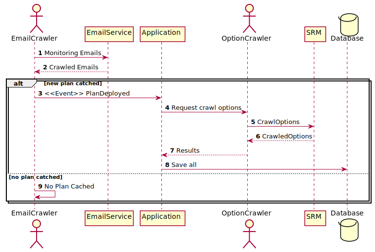

[KG System 홈페이지](https://kgsystem.co.kr)

## 첫 프로젝트 (스마트 공장 지원 사업)
관련 프로젝트의 Portfolio는 [여기](http://localhost:9000/posts/portfolio/kgsystem/mes)를 참고.
2019.06 ~ 2020.02 까지 근무하는 동안 프로젝트를 맡아 진행했었다.

국책과제로 스마트 공장 구축,보급 지원 사업의 일환으로 [삼성 주관 대중소 상생형 스마트 공장 지원 사업 유형 1-b](https://www.kbiz.or.kr/ko/contents/bbs/view.do?seq=132774&topFixYn=N&pg=2&pgSz=10&mnSeq=334&schFld=whle&schTxt=2019)를 진행하게 되었다.

프로젝트 규모는 총 1억1천만원의 비용에 6000만원의 지원금이었으며, 삼성측 멘토가 파견되어 사업 진행에 도움을 주는 방식으로 진행되었다.

## Tech Stack
기술 스택은 다음과 같이 정리된다.
- Webserver
  - Apache2
  - bind9
- Database
  - MySQL (Main Database)
  - Redis (For push-alarm sevice)
- Servier Side
  - Laravel (php)
  - Laravel Echo (socket.io)
- Client Side
  - React & MobX (javascript)
  - Echo (socket.io)
- Source Code Management
  - git & github
- CI|CD
  - github webhook
  - jenkins

언어 사용에 있어 큰 무리가 없게 언어 자체를 바꾸는 일은 없게 선택했으며, React는 이전의 jQuery보다 체계적으로, 재사용 할 수 있게 개발 하기 위해 선택했다.

본인은 React를 이전 부터 사용했고, 공모전 출전 경험도 있어 큰 무리가 없었지만, 사수는 처음 접하는 것이라 걱정되었다.
다행히도 금방 익숙해 졌으며 속도도 붙어 무리없이 완수할 수 있었다.

## 이전 작업
이전 작업은 이전보다 훨씬 수월하게 진행되었다. 이미 어느 정도 정리된 코드 덕에 완전히 재 구현하는 수준의 작업은 아니었고 마크업만 React로 재구성하면 되기에 수월하게 진행되었다.
Laravel이 관리해주는 라우트와 컨트롤러 덕에 쉽게 기능을 나눌 수 있었고, 사수도 React에 금방 적응하여 빠르게 옮길 수 있었다.

작업 초기에는 MobX를 사용하지 않고 오롯이 React만 사용하려 했었다. Context Api나 Redux같은 어려운 개념을 먼저 경험하는 것 보다, 불편함을 겪고난 후 해결책을 보는 것이 더 머리에 깊이 기억되기 때문이었다.

당연히 진행하면서 사수는 몇단계를 거치면서 내려오는 핸들러 함수나 prop에 대해 해결책이 없느냐고 물어왔고 그때 상태 관리 라이브러리를 언급했다.
이렇게 MobX가 선택되었고, 차질 없이 진행되었다.

## Crawler
이전 작업이 모두 끝나고, 기존 협의했던 기능인 Crawler를 만들게 되었다.
원하는 기능은 다음과 같이 정리된다.

1. 원청에서 배포되는 일정표를 사용해야 한다.
2. 원청에서 배포되는 일정은 2가지 내용이 누락되어있다.
   1. 제작품의 Option 사항
   2. 제작품의 도면 번호
3. 원청에서 배포되는 일정표를 2.의 내용이 포함되게 편집해야 한다.
4. 배포된 원본 일정표를 내려받을 수 있어야 한다.

사실 이 크롤러 관련된 이야기는 이전의 파트타임에서도 언급되었었지만 기간 문제로 기각 되었었다.
이번 사업을 기회 삼아 개발하게 되었다.

크롤링 라이브러리는 [Webklex/laravel-imap](https://github.com/Webklex/laravel-imap)을 사용했다. javascript 런타임을 내장하고 있어서 쉽게 원하는 결과를 얻을 수 있고, 지속적으로 업데이트되고 있기에 선택했다.

다행히도, 크롤링 하려는 사이트가 복잡하지 않고, 비동기 처리가 많지 않아서 쉽게 원하는 정보를 얻을 수 있었다.

처리 과정은 다음과 같이 설계했다.

1. 특정 사내 메일 주소를 모니터링 한다.
2. 수집된 이메일 목록을 반환 받는다
3. 신규 일정표를 배포받은 것을 감지한다.
4. 일정표 내용을 파싱해 호기 번호를 순회한다.
5. 원청에서 제공하는 SRM에서 옵션 사항을 크롤링한다.
6. 이를 배포 받은 일정표를 파싱한 데이터에 포함한다.
7. DB에 이를 반영한다.

위 과정을 보면 2개의 크롤러가 필요함을 알 수 있다.

EmailCrawler 제작 당시, 초기에는 단순하게 curl로 요청해 받은 결과를 html 파싱하려 했지만, 자바스크립트 런타임이 필요함을 알게 되어 위에 언급한 라이브러리를 사용하게 되었다.
메일 서비스 측에서 이메일 송수신 관련 API를 제공하지 않기 때문에 직접 주기적으로 모니터링 하고 있어야 했다. 이중 메일 제목과 첨부 파일의 제목을 기준으로 일정표 배포 여부를 확인해 모든 과정이 진행 되도록 만들었다.

OptionCrawler 또한 같은 라이브러리를 사용해 만들었다. 전달 받은 호기 번호를 통해 해당 호기 번호에 포함되어야할 옵션 사항을 고객사에서 제공하는 SRM에서 검색해 반환하도록 만들었다. 초기에 timeout이 발생했지만, php 설정을 이용해 해결 가능한 수준이었다.

이후 운영 중에 배포 여부를 알 수 없다는 (실제로, 배포 된 이후에 메일을 직접 보지 않으면 알 수 없었다.) 불편이 신고되어 Laravel Echo와 Redis로 알림 서비스를 만들어 배포했다.

발주서 관련 크롤러도 제작했다.

기본적인 흐름은 동일하며 수집된 데이터는 사내 BOM을 만들기 위한 초석으로 사용되었다.

## 퇴사
프로젝트를 무사히 마친 후, 퇴직 절차를 밟았다. 산업기능요원으로 계속 근무 할 수 없다는 것을 알게 되어 퇴직하게 되었고, 지인과의 정으로 유지보수를 조금씩 돕게 되었다.
간단한 변경 요청이나, 오류들을 학기 동안 잡아 나갔으며 다른 산업기능요원을 채용하고있는 IT업체에 계속 연락을 넣었다.

이 프로젝트를 진행한 기간이 내가 크게 성장 할 수 있던 기간이었고, 좀더 짜임새 있는 개발을 할 수 있던 기간이었다. 
처음으로 Web application framework를 다뤘으며, React를 활용해 규모 있는 client를 구성했고, 이에 따른 성능 문제도 경험하고 개선할 수 있었다.