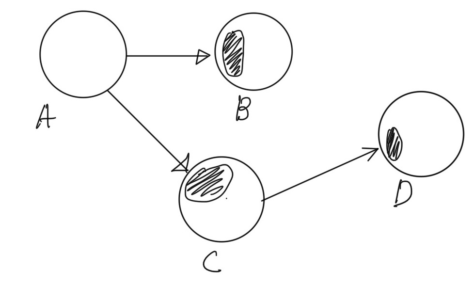
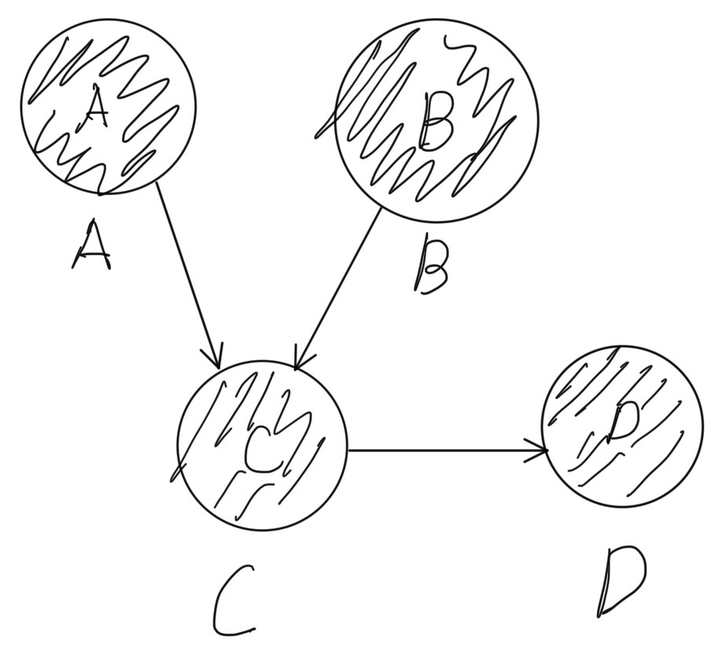

책임에 초점을 맞춰 설계할 때 가장 큰 어려움은 어떤 객체에게 어떤 책임을 할당할지를 결정하기 쉽지 않다는 것이다.  
모든 책임 활동은 트레이드오프 활동이며, 여러 방법중 최선의 할당 방법을 선택하는 것이다.  

## 책임 주도 설계를 향해
책임 중심 설계를 위한 2가지 원칙
- 데이터보다 행동을 먼저 결정하라
- 협력이라는 문맥 안에서 책임을 결정하라. 

위의 두 원칙의 핵심은 객체를 데이터가 아닌 협력을 중심으로 생각하는 것이다. 

### 데이터보다 행동을 먼저 결정하라.
데이터는 객체가 책임을 수행하는 데 필요한 재료를 제공할 뿐이다. 책임 중심 설계는 "이 객체가 수행헤야할 책임은 무엇인가?"를 먼저 결정한 후에  
"이 책임을 수행하는데 필요한 데이터는 무엇인가"를 결정한다. 책임을 먼저 결정한 후에 객체의 상태를 결정하는 것이다.

### 협력이라는 문맥 안에서 책임을 결정하라.
책임은 객체의 입장이 아니라 객체가 참여하는 협력에 적합해야 한다. 협력은 메시지를 전송하는 객체로부터 시작되기 때문에 적합한 책임이란 메시지 전송자에게 적합한 책임을 의미한다.  
즉, 메시지를 전송하는 클라이언트에게 적합한 책임을 할당해야 한다.

객체를 결정한 후에 메시지를 선택하는것이 아닌, 메시지를 결정한 후에 적합한 객체를 선택해야 한다. 메시지가 존재하기 때문에 객체가 존재하는 것이다. 

> 객체를 갖고있기 때문에 메시지를 보내는것이 아니다. 메시지를 전송하기 때문에 객체를 갖게 된 것이다.[Metz12].

문맥 안에서 메시지에 집중하는 책임은 더 깔끔하고 수월하게 캡슐화의 원칙을 지켜낼 수 있다. 반면 데이터 중심의 설계는 내부의 상태를 밖에서 알아야하기 때문에 캡슐화가 약화된다.

### 책임 주도 설계
핵심은 책임을 결정한 후에 책임을 수행할 객체를 결정하는 것이다. 협력에 참여하는 객체들의 책임이 어느정도 정리될 때까지는 객체 내부의 상태에는 관심을 가지지 않는다. 

## 책임 할당을 위한 GRASP 패턴
GRASP 패턴이란?
- General Responsibility Assignment Software Pattern [Craig Larman]
- 일반적 책임 할당을 위한 소프트웨어 패턴
- 객체에게 책임을 할당할 때 지침으로 사용할 수 있는 원칙들
- 총 9가지 원칙
    - Information Expert (정보 전문가)
    - Creator (창조자)
    - Controller (조율자)
    - Low coupling (낮은 결합도)
    - Polymorphism (다형성)
    - Pure fabrication (순수 제작?)
    - Indirection (간접 참조)
    - Protected variation (변경 보호)

### 도메인 개념에서 출발하기
어떤 책임을 할당할 때 가장 먼저 고려해야할 것은 도메인이다. 도메인 안에는 무수히 많은 개념이 존재하며 도메인의 개념들을 책임 할당의 대상을 생각하면 좀더 수월하다.
그러나 도메인 개념을 정리하는데 오랜 시간을 할애해서는 안된다. 완벽한 도메인 모델이란 존재하지 않고, 정말 중요한 것은 설계를 시작하는 것이기 때문이다. 

### 정보 전문가에게 책임을 할당하라
앞서 2장에서 본 내용이다. 어떤 책임을 수행하기에 가장 적합한 객체는 그 책임에 대해 가장 잘 알고 가장 잘 할수 있는 객체이다. 
가장 처음 객체에게 책임을 할당하기 위한 질문은 어떤 메시지가 필요한지에 대한 질문이다.
> 메시지를 전송할 객체는 무엇을 원하는가?

이는 해결해야할 문제를 파악하는 질문이기도 하다. 해결해야할 문제가 무엇이고 해결하기 위해서 필요한 메시지는 무엇인지를 찾는다.

메시지를 결정한 다음으로 생각해야할 질문을 이 메시지를 처리할 객체는 무엇인가에 대한 질문이다.
> 메시지를 수신할 적합한 객체는 누구인가?

이 질문에 답하기 위해서는 객체가 상태화 행동을 통합한 캡슐화의 단위라는 사실에 집중해야 한다. 객체의 책임과 책임을 수행하는데 필요한 상태는 동일한 객체 내에 존재해야 한다. 
따라서 객체에게 책임을 할당하는 첫 번째 원칙은 정보 전문가에게 책임을 할당하는 것이다.

정보 전문가 패턴(Information Expert pattern)은 객체가 자신이 소유하고 있는 정보와 관련된 작업을 수행한다는 일반적인 직관을 표현한 것이다.  
여기서 한가지 중요한 것은 **정보 !== 데이터** 라는 사실이다. 객체가 정보를 필요로 한다 해서 꼭 **저장** 하고있을 필요는 없다.

### 높은 응집도와 낮은 결합도
높은 응집도와 낮은 결합도는 객체에 책임을 할당할 때에 항상 고려해야 하는 기본 원리이다. 객체가 자신의 밖의 내용을 많이 알 수록 결합도는 높아지며  내부에만 집중할 수록 응집도는 높아진다.  

위 그림은 높은 결합도를 간략히 그림으로 나타낸 것이다. D 객체에서 C 객체가 참조하고있는 내용에 변경이 생기면 C 객체도 변경해야 하며 이 변경은 다시 C 객체의 내부에 의존하고있는 다른 객체에게도 전파된다.  

위 그림은 각 객체가 높은 응집도를 보일 경우를 그림으로 표현한 것이다. 각 객체의 관심은 내부에 집중되어있기 때문에 각 객체의 변경은 외부를 오염시키지 않고 객체 내부에서만 유지된다. 

낮은 결합도와 높은 응집도는 개발 이후의 유지 보수성을 높여준다. 객체가 자기 자신에게 집중할 수록 변경은 외부로 흘러나가지 않고, 외부의 객체는 변경되지 않는 퍼블릭 인터페이스를 참조한다.  
Low Coupling(낮은 결합도)와 High Cohesion(높은 응집도)는 설계를 진행하면서 책임과 협력의 품질을 검토하는데 사용할 수 있는 중요한 평가 기준이다. 

### 창조자에게 객체 생성 책임을 할당하라.
Creator 패턴의 의도는 어떤 방식으로든 생성되는 객체와 연결되거나 관련될 필요가 있는 객체에 해당 객체를 생성할 책임을 맞기는 것이다.  
이 둘은 이미 강한 결합을 갖고있기 때문에 이 객체에 생성 책임을 할당하는 설계의 전체적인 결합도에 영향을 미치지 않는다. 이미 존재하는 객체 사이의 관계를 사용하기 때문에 전체 설계는 낮는 결합도를 유지할 수 있다. 

### 다형성을 통해 분리하기
객체의 타입에 따라 행동이 달라진다면, 우선 객체를 타입으로 분리하고 행동을 각 타입의 책임으로 할당하는 방법을 GRASP에서는 Polymorphism이라 한다.   
로직의 분기를 if~else, switch~case 로만 분리한다면, 이후 유지보수시 수정을 어렵게하고 변경에 취약하게 만든다. 이때 다형성을 사용해 분리하게되면 확장성을 챙길 수 있게된다. 

### 변경으로부터 보호하기
Protected Variation(변경 보호)는 쉽게 말해 변경할 이유에 따라 분리하고, 캡슐화 하는 것을 말한다. 하나의 객체는 하나의 변경이유로만 변경해야 한다.  
하나의 변경을 위해 여러 객체를 변경해야 하는 것은 프로그램의 유연성을 떨어뜨리고 확장성을 떨어뜨린다. 

이를 위해서는 변경 예상지점을 식별하고 그 주위에 안정된 인터페이스를 형성하도록 책임을 할당해야 한다. 변하는 것이 무엇인지 고려하고 변하는 개념을 캡슐화 하는 것은 변화의 전파를 최소화 한다.

### 변경과 유연성
개발자들이 변경에 대비할 수 있는 방법은 두 가지가 있다. 
1. 코드를 이해하고 수정하기 쉽도록 단순하게 작성
2. 코드를 수정하지 않고도 변경을 수용할 수 있도록 유연하게 설계

대부분의 경우 1.이 좋은 방법이지만, 코드가 빈번하게 반복될 경우 복잡성을 감수하더라도 2.를 하는것이 더 좋은 방법이다.

## 책임 주도 설계의 대안
책임 주도 설계를 적용하는데 어려움이 있다면, 다음의 대안을 활용할 수 있다.  
우선 목표로 하는 기능을 우선 구현한 후, 해당 기능을 유지한 채 리팩터링 하는 것이다.  

### 메서드 응집도
복잡한 기능을 구현하다보면 하나의 메서드가 프로세스와 같이 굉장히 길어지고 파악하기 어려워지는 경우가 생긴다. 이런 메서드를 몬스터 메서드라고 부른다. [Michael Feathers]  
대부분의 이런 메서드들은 응집도가 낮아 변경의 이유가 하나 이상이며 메서드 흐름을 파악하기 위한 주석이 필요하다. 

응집도 높은 메서드는 변경의 이유가 단 하나여야 한다. 메서드의 흐름을 한 눈에 볼 수 있어야 하며 메서드의 흐름을 읽는 것 자체가 일련의 주석을 읽는 것과 같이 간결해야 한다. 

### 객체를 자율적으로 만들자
메서드의 응집도를 높여 분리했다면 객체의 응집도를 높일 차례다. 응집도 높은 메서드 중 객체의 책임에 맞지 않는 메서드를 올바른 책임을 진 객체로 옮기는 것이다.  
리팩터링 결과는 올바름 책임을 갖고, 하나의 관심사에 집중되어있는 설계를 얻게 된다. 높은 캡슐화, 높은 응집도, 낮은 결합도의 설계가 구현되는 것이다.

