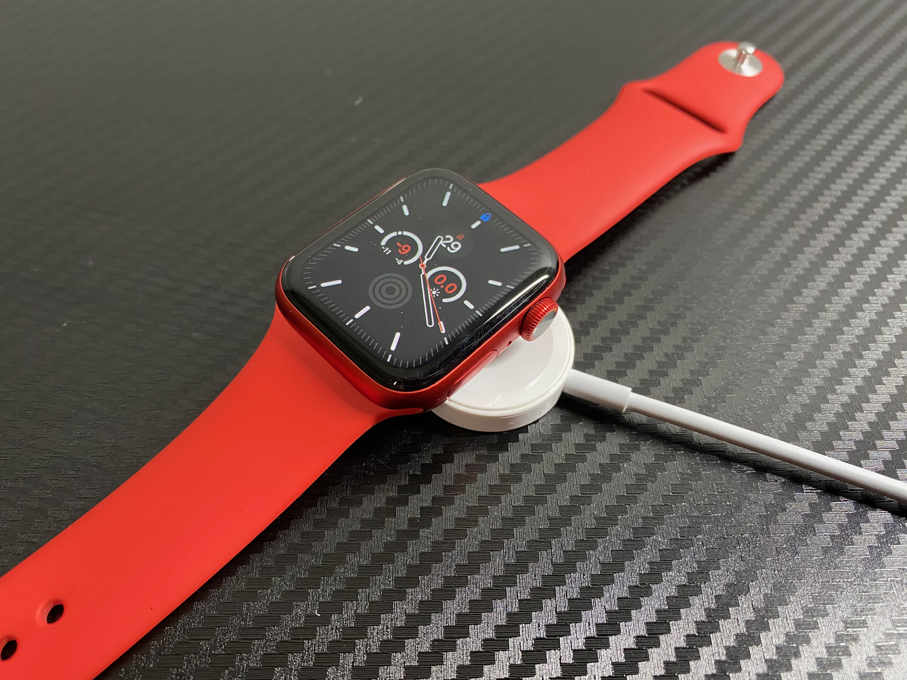
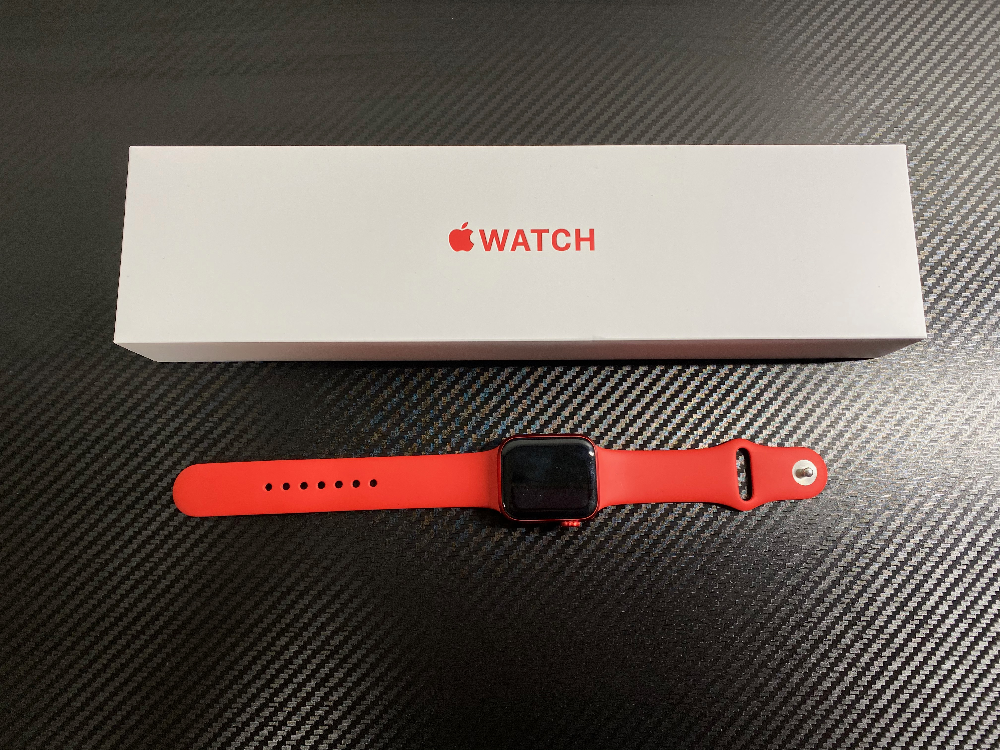
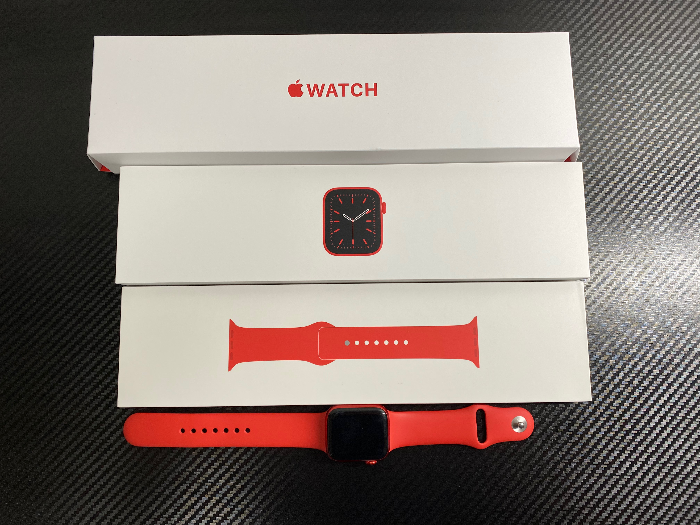
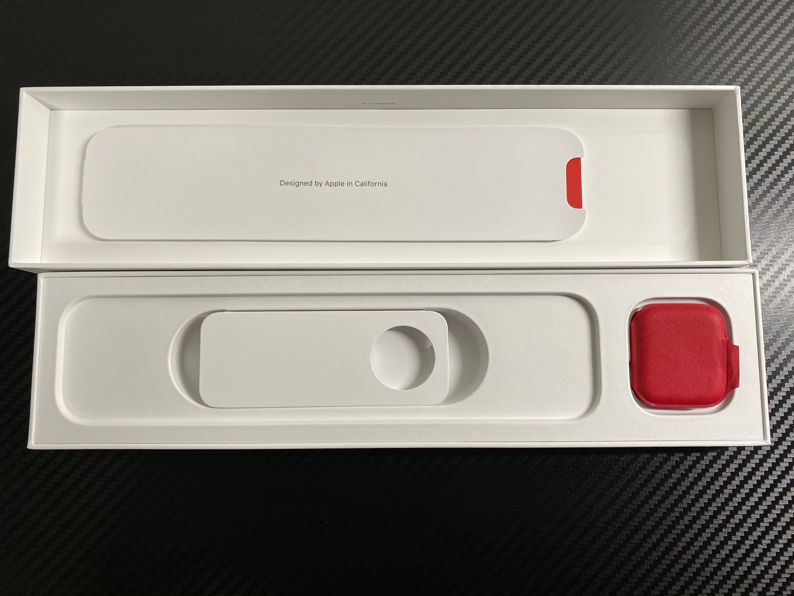
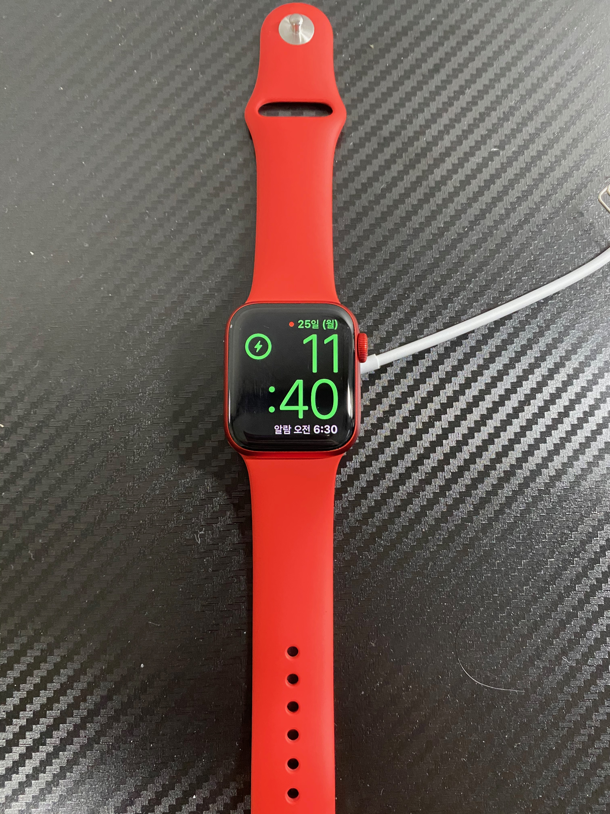
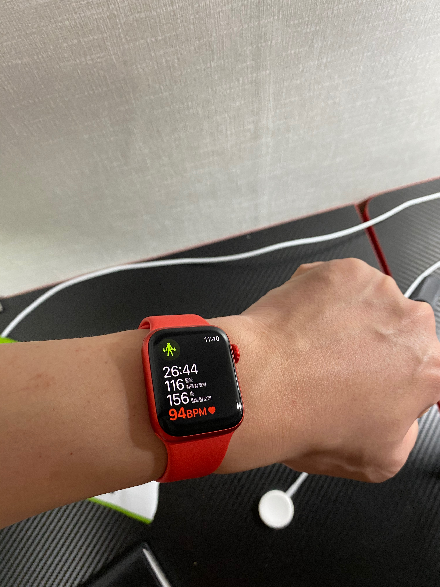

### 첫 스마트 워치
나의 첫 스마트 워치는 Galaxy Gear3다. 회사에 있던 테스트 기기를 일주간 사용할 수 있었다. 스마트 워치에 대해 IT 뉴스 및 소식 글 등으로 출시 등은 알고 있었다.  
그러나 가격이 제법 나가기 때문에 선뜻 구매 욕구는 일어나지 않았었고 사서 이걸로 무엇을 할까 생각이 들었다.  

하지만 직접 사용해보니 생각이 180도 바뀌었다. 당시 사용했던 스마트폰은 갤럭시 S10+ 5G로 Gear S3를 사용하기 딱 좋았다.  
스마트폰과 연동해두면 자동으로 내 활동이 모니터링 되어 내가 얼마나 움직였는지 (움직이지 않았는지)알 수 있었고, 삼성 조합의 최대 장점인 삼성 페이도 손목으로 사용할 수 있었다. 

제법 편리한 기능 덕에 마음이 많이 이끌렸으나 착용감이 상당히 큰 걸림돌로 다가왔다. 바디가 생각 보다 두꺼워 손목을 타이트하게 조이지 않으면 상당히 많이 흔들렸고 스트랩도 그만큼 두꺼웠다.  
기종이 오래전에 출시했던 모델인 탓임도 있지만 이렇게 무겁고 거슬리는것을 계속 차고다니기에는 무리가 있을 것 같다고 생각했다. 또한 하루를 겨우 버텨주는 배터리도 구매의욕을 꺽는 원인중 하나였다.  
사용했던 기기는 테스트 기기여서 제대로 관리되지 않아 하루는 커녕 반나절도 가지 못했다. 정상적인 배터리 수명에 일반적인 사용 패턴이라면 하루 조금 안되게 버틴다고 한다. 

### 구매 결정
그렇게 시간이 지나 스마트폰을 아이폰 11로 바꾸면서 애플 워치를 구매하게 되었다. 구매 목적은 활동 모니터링이 제일 컸다. 기어를 사용했을때 걷기나 뛰기 모니터링은 큰 감동으로 다가왔었다.  
손목에서 지속적으로 울려주니 움직이는데 가벼운 동기부여도 되었고 내가 얼마나 움직였는지 폰에서 확인할 수 있던 것도 좋은 기억이었다.  

그래서 주변 기기 생태계를 apple로 바꾸는 김에 구매를 결정할수 있었다. 본인은 애플워치 시리즈6 product red를 구매했다.

### 구성
패키징은 애플 답게 역시 깔끔하다. 

포장에 사용된 소재는 견고한 코팅지인 것 같다. 손으로 집어들었을 때 견고하다는 느낌이 강하게 든다. 

겉 포장을 풀면 본체, 각종 설명과 인증서와 스트랩이 위와 같이 별도로 묶여있다.

본체 사진이 인쇄된 상자를 열면 충전기, 각 인증서 설명서, 본체가 놓여있다. 애플 답게 포장도 신경써서 했다는 인상이다.  
저 빨간 한지 같은 종이에 본체가 래핑되어있다.

본체와 스트랩을 조립하고, 충전기에 붙이면 자동으로 탁상 시계 모드로 들어간다. 
    
### 사용기
#### 착용감
본인은 앞서 서두에 언급한 내용을 보면 손목 시계를 즐겨 착용하는 편이 아님을 알수 있을것이다. 책상앞에 오래 앉아있는 생활 패턴도 손목의 자유를 찾게되는 이유중 하나이다.  
이 덕에 손목 시계를 찾지 않게 되었고 스마트 워치는 당연히 눈여겨보지도 않았엇다.  

애플워치는 이전의 기어와는 완전히 달랐다. 적당히 활동적일 수 있는 무게에 오히려 얇다는 느낌이 드는 두께는 전혀 부담을 주지 않았고 기본 스트랩은 너무 헐겁지도 너무 타이트하지도 않게 적당했다.  
긴팔을 입고도 크게 걸리적 거리지 않았고 책상에서 타이핑할때도 불편감은 없었다.

활동시에도 워낙 가볍고 크지 않아 불편하지 않았다. 일반적인 시계정도 혹은 그보다 더 얇다는 느낌을 받았고 평소 시계를 자주 차고다닌다면 느끼지 못할것 같았다.   
실제로도 익숙해지니 차고있는 동안에는 불편감은 없었다. 

### 기능
애플 워치의 존재감을 나타내는 기능은 역시 헬스케어라 생각한다. 일상 속에 페이스 메이커와 함께 다니는 기분을 들기에 충분헸다.

심호흡 세션은 주기적으로 스트레스를 낮추게끔 도와주며 1시간 이상 움직이지 않게되면 자리에서 일어나 움직이기를 알려준다.  
또한 5분 이상 걷게 되면 걷는 속도와 심박수를 기록해 내가 얼마나 이동했는지를 보여준다. 

운동량 기록 또한 탁월했다. 운동 시작 전에 내가 할 운동을 미리 정해두면 심박수와 행동 모니터링을 통해 운동량을 기록해주며  
칼로리 계산으로 내가 얼마나 움직였는지를 알려준다.  
실제로 홈트레이닝을 강제로 하고있는 요즘엔 개인 PT를 받는 느낌을 받을 수 있었다. 운동 시간, 운동량을 정량적으로 알려준다는 것이 아주 마음에 들었다. 
    
추가적으로 애플 워치를 착용하고있는 동안에는 맥북 잠금 해제를 자동으로 할 수 있다. Touch ID를 사용중이더라도 애플워치를 착용중이라면 알아서 잠금해제되어 빠르게 하던 일을 이어갈 수 있다.
    
### 구매 추천
애플워치는 애플 생태계에서만 위력을 발휘한다. 애플 생태계에 있거나 옮길 계획이라면 구매를 추천한다.  
과장 조금 보탠다면 개인 비서를 둔것 같은 경험을 얻을 수 있다.

최근 업데이트를 통해 본인이 아이폰을 사용하지 않더라도 가까운 주변인이 사용중이라면 연동할 수 있게 되었다. 조금은 불편 하지만 가족 사용이라면 충분해 보인다.  
내가 아이폰을 사용하지 않고 내 주변에 아이폰 사용자가 없다면 구매할 이유가 없다. 연동할 방법이 없기 때문이다.  

