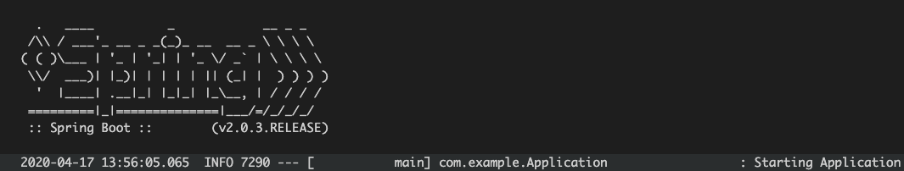
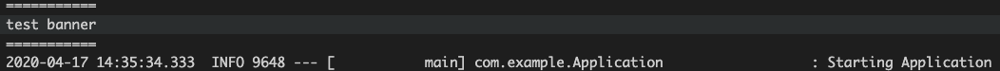
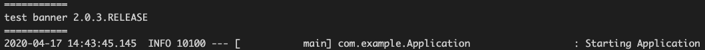

### 기본적인 Spring Application 실행 방법
```java
package com.example;

import org.springframework.boot.SpringApplication;
import org.springframework.boot.autoconfigure.SpringBootApplication;

@SpringBootApplication
public class Application {
    public static void main(String[] args) {
        SpringApplication.run(Application.class, args); 
    }
}
```

위 코드는 SpringApplication 인스턴스를 직접 만들지 않고, 자동으로 설정등을 Spring 프레임워크에게 맞기고 내 application을 실행한다.
간단하고 좋은 방법이지만, Spring이 제공하는 Customize 기능들을 포기하게 된다.

```java
package com.example;

import org.springframework.boot.SpringApplication;
import org.springframework.boot.autoconfigure.SpringBootApplication;

@SpringBootApplication
public class Application {
    public static void main(String[] args) {
        SpringApplication app = new SpringApplication(Application.class);
        app.run(args);
    }
}
```
이렇게 인스턴스를 직접 만들어 App을 실행 할 수도 있다.

---

### 로그 레벨 조정
실행된 Application의 로그 레벨은 기본적으로 INFO 레벨이며 실행 인자에 디버그 모드를 명시하면 디버그 모드로 동작하게 된다.
디버그 모드로 동작 할 경우 로그 내용은 더 자세하게 표시되며 로드된 자동 설정 내역과 실패한 설정 로드 이력을 표시한다.

IDE의 실행 시 인자를 편집해 -Ddebug 옵션을 추가하거나 (JVM Options)
빌드된 결과물을 직접 Debug모드로 실행할 수 있다.
```
java -jar /path/to/jar -Ddebug
```

---
### 배너 변경

배너란?
- Application 실행시 표시되는 로고, 버전 등.


Application의 실행시 표시되는 배너를 변경하기 위해서는 src/main/resources/banner.txt를 생성해 그 안에 원하는 배너를 텍스트로 구성하면 된다.
```
// src/main/resources/banner.txt
===========
test banner
===========
```



배너에 지원되는 변수가 있어 Application의 정보등을 배너에 표시할 수 있다.

```
// src/main/resources/banner.txt
=========== 
test banner ${spring-boot.version}
===========
```



지원되는 변수 목록은 [링크](https://docs.spring.io/spring-boot/docs/current/reference/html/spring-boot-features.html#boot-features-banner)를 확인 

이미지도 지원한다. 파일이름을 banner로 저장 할 경우 자동으로 로드해 준다.

src/main/resources 이외의 위치에서 banner를 만들고 싶을 경우 application.properties, application.yml에서 설정할 수 있다.

```yaml
spring:
    banner:
        location: :classpath/banner.txt
``` 

Application에서 banner를 조작할 수 있다.

```java
package com.example;

import org.springframework.boot.SpringApplication;
import org.springframework.boot.autoconfigure.SpringBootApplication;
import ort.springframework.boot.Banner;

@SpringBootApplication
public class Application {
    public static void main(String[] args) {
        SpringApplication app = new SpringApplication(Application.class);
        app.setBannerMode(Banner.Mode.Off); // 배너를 표시하지 않는다.
        app.run(args);
    }
}
```

```java
package com.example;

import java.io.PrintStream;

import org.springframework.boot.Banner;
import org.springframework.boot.SpringApplication;
import org.springframework.boot.autoconfigure.SpringBootApplication;
import org.springframework.core.env.Environment;

@SpringBootApplication
public class Application {
    public static void main(String[] args) {
        SpringApplication app = new SpringApplication(Application.class);
        // 배너를 직접 생성
        app.setBanner(new Banner(){
        
            @Override
            public void printBanner(Environment environment, Class<?> sourceClass, PrintStream out) {
                out.println("==================");
                out.println("test banner");
                out.println("==================");
            }
        });
        app.run(args);
    }
}
```

---
### Builder Pattern 사용 (SpringApplicationBuilder)

```java
package com.example;

import org.springframework.boot.autoconfigure.SpringBootApplication;
import org.springframework.boot.builder.SpringApplicationBuilder;

@SpringBootApplication
public class Application {
    public static void main(String[] args) {
        new SpringApplicationBuilder()
            .sources(Application.class)
            .run(args);
    }
}
```

동일하게 banner 변경이 가능하다.
```java
package com.example;

import java.io.PrintStream;

import org.springframework.boot.Banner;
import org.springframework.boot.autoconfigure.SpringBootApplication;
import org.springframework.boot.builder.SpringApplicationBuilder;
import org.springframework.core.env.Environment;

@SpringBootApplication
public class Application {
    public static void main(String[] args) {
        new SpringApplicationBuilder()
            .sources(Application.class)
            .banner(new Banner(){
            
                @Override
                public void printBanner(Environment environment, Class<?> sourceClass, PrintStream out) {
                    out.println("==================");
                    out.println("test banner");
                    out.println("==================");
                }
            })
            .run(args);
    }
}
```