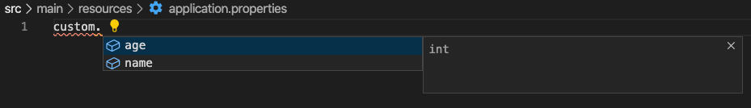

<!--truncate-->
### 외부 설정

외부 설정을 정의할 수 있는 위치는 기본적으로 다음과 같다.
- src/main/resources/application.properties
- src/main/resources/application.yml
- 환경 변수
- command line arguments
<!--truncate-->

아래 코드로 테스트 결과를 확인할 수 있다.
```java
package com.example;

import org.springframework.beans.factory.annotation.Value;
import org.springframework.boot.ApplicationArguments;
import org.springframework.boot.ApplicationRunner;
import org.springframework.stereotype.Component;

@Component
public class SampleRunner implements ApplicationRunner {

    @Value("${custom.name}")
    private String name;
    
    @Override
    public void run(ApplicationArguments args) throws Exception {
        System.out.println("=================================");
        System.out.println(name);
        System.out.println("=================================");
    }
}
```

```yaml
# src/main/resources/application.yml
custom:
    name: test
```

실행 결과
```
2020-04-20 11:29:57.703  INFO 3188 --- [           main] com.example.Application                  : Started Application in 1.62 seconds (JVM running for 2.141)
=================================
test
=================================
```

### 우선 순위
우선 순위는 굉장히 많은 단계가 있다.
1. 유저 홈 디렉토리에 있는 spring-boot-dev-tools.properties
2. 테스트에 있는 @TestPropertySource
3. @SpringBootTest 애노테이션의 properties 애트리뷰트
4. 커맨드 라인 아규먼트
5. SPRING_APPLICATION_JSON (환경 변수 또는 시스템 프로티) 에 들어있는 프로퍼티
6. ServletConfig 파라미터
7. ServletContext 파라미터
8. java:comp/env JNDI 애트리뷰트
9. System.getProperties() 자바 시스템 프로퍼티
10. OS 환경 변수
11. RandomValuePropertySource
12. JAR 밖에 있는 특정 프로파일용 application properties
13. JAR 안에 있는 특정 프로파일용 application properties
14. JAR 밖에 있는 application properties
15. JAR 안에 있는 application properties
16. @PropertySource
17. 기본 프로퍼티 (SpringApplication.setDefaultProperties)

따라서 위의 예제는 15 순위 JAR 안에 있는 application properties를 사용한 것이다.

테스트 케이스용 외부 설정도 정의할 수 있다.
src/test/application.{yml, properties}에 정의하면 테스트 진행시 해당 파일을 resources에 정의된 application.{yml, properites} 무시하고 로드한다.

다음 테스트를 보면 그 차이를 확인 할 수 있다.

```java
package com.example;

import org.springframework.beans.factory.annotation.Value;
import org.springframework.boot.ApplicationArguments;
import org.springframework.boot.ApplicationRunner;
import org.springframework.stereotype.Component;

@Component
public class SampleRunner implements ApplicationRunner {

    @Value("${custom.name}")
    private String name;

    @Value("${custom.age}")
    private int age;
    
    @Override
    public void run(ApplicationArguments args) throws Exception {
        System.out.println("=================================");
        System.out.println(name);
        System.out.println(age);
        System.out.println("=================================");
    }
}
```

```yaml
# src/main/resources/application.yml
custom:
    name: test
    age: ${random.int} # 랜덤 값 지정
```

실행 결과
```
2020-04-20 12:07:42.766  INFO 5853 --- [           main] com.example.Application                  : Started Application in 1.38 seconds (JVM running for 1.878)
=================================
test
1063398586
=================================
```
무사히 실행 된다. 

### 테스트 설정
테스트 케이스는 어떨까?
아래와 같이 테스트 케이스를 만들어 테스트를 진행한다.
```java
package com.example;


import static org.assertj.core.api.Assertions.assertThat;

import org.junit.Test;
import org.junit.runner.RunWith;
import org.springframework.beans.factory.annotation.Autowired;
import org.springframework.boot.test.context.SpringBootTest;
import org.springframework.core.env.Environment;
import org.springframework.test.context.junit4.SpringRunner;

@RunWith(SpringRunner.class)
@SpringBootTest
public class SampleRunnerTest {

	@Autowired
	Environment env;

	@Test
	public void testRun() throws Exception {
		assertThat(env.getProperty("custom.name"))
			.isEqualTo("test");
	}
}
```

```yaml
# src/test/resources/application.yml
custom:
    name: test
```
이제 테스트를 진행하면 테스트가 실패함을 볼수 있다. 에러 로그를 보면 다음과 같이 age 속성을 확인 할 수 없다고 나온다.
```
org.springframework.beans.factory.BeanCreationException: Error creating bean with name 'sampleRunner': Injection of autowired dependencies failed; nested exception is java.lang.IllegalArgumentException: Could not resolve placeholder 'custom.age' in value "${custom.age}"
```

이는 test의 설정에도 같은 속성을 정의하면 해결되지만, 이후에 어떤 속성이 추가될 지 모르기 때문에 별도의 파일로 관리 하는 것을 권장한다.
또한 @PropertySoruce는 yml 파일을 지원하지 않다 하니 .properties 로 변경할 것을 권장한다.

```properties
# src/main/resources/application.properties
custom.name=app
custom.age=${random.int} # 랜덤 값 지정
```

```properties
# src/test/resources/test.properties
custom.name=test
```
```java
package com.example;

import org.junit.Test;
import org.junit.runner.RunWith;
import org.springframework.beans.factory.annotation.Autowired;
import org.springframework.boot.test.context.SpringBootTest;
import org.springframework.core.env.Environment;
import org.springframework.test.context.TestPropertySource;
import org.springframework.test.context.junit4.SpringRunner;

import static org.assertj.core.api.Assertions.assertThat;

@RunWith(SpringRunner.class)
@TestPropertySource(locations = "classpath:/test.properties")
@SpringBootTest
public class SampleRunnerTest {

    @Autowired
    Environment env;

    @Test
    public void testRun () throws Exception {
        assertThat(env.getProperty("custom.name"))
                .isEqualTo("test");
    }
}
```
위 테스트 케이스를 실행하면 통과할 것이고, 이전의 SampleRunner를 통해 표시되는 내용도 달라진 것을 확인 할 수 있다.
```
2020-04-20 14:11:55.186  INFO 11797 --- [           main] com.example.SampleRunnerTest             : Started SampleRunnerTest in 1.74 seconds (JVM running for 2.491)
=================================
test
-994668283
=================================
```
src/main/resources/application.properties의 내용에 custom.name 을 app으로 변경했음에도 불구하고, 표시되는 내용은 src/test/resources/test.properties의 내용이 사용되었다.
이는 우선순위가 더 높은 설정(2순위의 @TestPropertySource)이 낮은 우선 순위의 설정(15순위의 JAR 안의 application.properties)를 덮어 쓰며 생긴 현상이다. 
이전의 덮어쓰기와의 차이점은 설정 파일 자체를 교체한 것이 아닌, 파일 내용을 보며 키값을 비교해, 더 높은 우선 순위의 것을 사용한 점이다.

### 파일이 application.properties로 같은 경우에는 어떻게 될까?
우선순위는 다음과 같다.
1. file:./config/
2. file:./
3. classpath:./config/
4. classpath:./

``file:./``은 현재 프로젝트의 루트 디렉토리를 의미한다.

즉 ``src/main/resources/application.properties``는 4순위의 우선순위를 갖는다. 

### 타입 세이프 프로퍼티 @ConfigurationProperties
property 들을 Bean으로 등록 할 수 있다.

아래 의존성을 추가하면 내 프로젝트의 커스텀 설정의 메타데이터를 만들 수 있다.
예를 들면, IDE에서 properties 작성중 자동 완성의 정보를 만들 수 있다.
```xml
<dependency>
	<groupId>org.springframework.boot</groupId>
	<artifactId>spring-boot-configuration-processor</artifactId>
	<optional>true</optional>
</dependency>
```

```java
package com.example;

import org.springframework.boot.context.properties.ConfigurationProperties;
import org.springframework.stereotype.Component;

@Component
@ConfigurationProperties("custom")
public class CustomProperties {
    private String name;
    private int age;

    public String getName() {
        return this.name;
    }

    public void setName(String name) {
        this.name = name;
    }

    public int getAge() {
        return this.age;
    }

    public void setAge(int age) {
        this.age = age;
    }
}
```

이렇게 빈(Bean)으로 등록한 Property를 사용하기 위해 SampleRunner도 변경한다.

```java
package com.example;

import org.springframework.beans.factory.annotation.Autowired;
import org.springframework.boot.ApplicationArguments;
import org.springframework.boot.ApplicationRunner;
import org.springframework.stereotype.Component;

@Component
public class SampleRunner implements ApplicationRunner {

    @Autowired
    CustomProperties custom;
    
    @Override
    public void run(ApplicationArguments args) throws Exception {
        System.out.println("=================================");
        System.out.println(custom.getName());
        System.out.println(custom.getAge());
        System.out.println("=================================");
    }
}
```

이후 실행하면 정상적으로 설정 내용이 표시 될 것이다.

추가로, configuration processor를 추가한 결과도 다음과 같다.

내가 만든 커스텀 설정이 자동완성을 지원하게 되었다.

이 방식으로 설정을 적용할 경우 key의 case문제가 해결된다.
camelCase, kebap-case 등 모두 자동으로 적용된다.

또한 타입 컨버젼도 지원한다.

```java
package com.example;

import java.time.Duration;
import java.time.temporal.ChronoUnit;

import org.springframework.boot.context.properties.ConfigurationProperties;
import org.springframework.boot.convert.DurationUnit;
import org.springframework.stereotype.Component;

@Component
@ConfigurationProperties("custom")
public class CustomProperties {
    private String name;
    private int age;

    @DurationUnit(ChronoUnit.SECONDS)
    private Duration duration;

    public Duration getDuration() {
        return this.duration;
    }

    public void setDuration(Duration duration) {
        this.duration = duration;
    };

    public String getName() {
        return this.name;
    }

    public void setName(String name) {
        this.name = name;
    }

    public int getAge() {
        return this.age;
    }

    public void setAge(int age) {
        this.age = age;
    }

}
```
이렇게 @DurationUnit을 사용해 Duration 타입으로 자동으로 변경된다.
또 @DurationUnit을 사용하지 않고도, properties 정의 시에 값에 s, ns 등으로 시간을 알수 있는 접미사를 붙이면 자동으로 변경된다.

프로퍼티 값 검증도 지원한다.

@Validated, 또는 JSR-303(@NotNull, ...)을 모두 지원한다.
