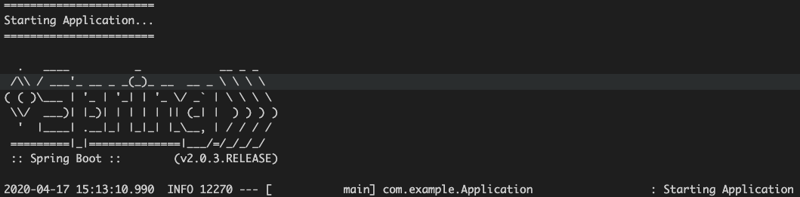
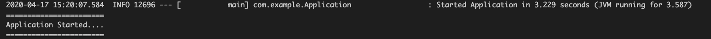
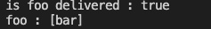
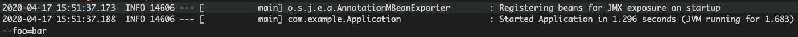

<!--truncate-->
### Application Event

Application Event Listener 생성

```java
package com.example;

import org.springframework.boot.context.event.ApplicationStartingEvent;
import org.springframework.context.ApplicationListener;
import org.springframework.stereotype.Component;

/**
 * Application이 시작 될 때의 이벤트 리스너
 */
@Component
public class SampleListener implements ApplicationListener<ApplicationStartingEvent> {

    @Override
    public void onApplicationEvent(ApplicationStartingEvent arg0) {
        System.out.println("=======================");
        System.out.println("Starting Application...");
        System.out.println("=======================");
    }
    
}
```

그런데 위의 ApplicationStartingEvent는 @Component 어노테이션으로 Bean등록을 했음에도 ApplicationContext 생성 이전의, 완전 시작점의 이벤트라서 정상 작동하지 않는다.
따라서 Application에 따로 등록해야 한다.

```java
package com.example;


import org.springframework.boot.SpringApplication;
import org.springframework.boot.autoconfigure.SpringBootApplication;

@SpringBootApplication
public class Application {
    public static void main(String[] args) {
        SpringApplication app = new SpringApplication(Application.class);
        app.addListeners(new SampleListener());
        app.run(args);
    }
}
```

```java
package com.example;

import org.springframework.boot.context.event.ApplicationStartingEvent;
import org.springframework.context.ApplicationListener;

/**
 * Application이 시작 될 때의 이벤트 리스너
 */
public class SampleListener implements ApplicationListener<ApplicationStartingEvent> {

    @Override
    public void onApplicationEvent(ApplicationStartingEvent arg0) {
        System.out.println("=======================");
        System.out.println("Starting Application...");
        System.out.println("=======================");
    }
    
}
```

실행 결과


Bean으로 등록한 이벤트의 경우

```java
package com.example;

import org.springframework.boot.SpringApplication;
import org.springframework.boot.autoconfigure.SpringBootApplication;

@SpringBootApplication
public class Application {
    public static void main(String[] args) {
        SpringApplication app = new SpringApplication(Application.class);
        app.run(args);
    }
}
```

```java
package com.example;

import org.springframework.boot.context.event.ApplicationStartedEvent;
import org.springframework.context.ApplicationListener;
import org.springframework.stereotype.Component;

/**
 * Application이 시작 될 때의 이벤트 리스너
 */
@Component
public class SampleListener implements ApplicationListener<ApplicationStartedEvent> {

    @Override
    public void onApplicationEvent(final ApplicationStartedEvent arg0) {
        System.out.println("=======================");
        System.out.println("Application Started....");
        System.out.println("=======================");
    }
    
}
```

실행 결과


---

### Web Application Type

기본적으로 servlet으로 동작하며 이후 사용 의존성에 따라 설정이 필요하다. 의존성에 Spring MVC가 없고, WebFlux로 구성할 경우, REACTIVE로 변경해야 하며 WebApp이 아닌 경우에는
NONE으로 설정해야 한다.

Application 실행부에서 이를 조작할 수 있다.

```java
package com.example;


import org.springframework.boot.SpringApplication;
import org.springframework.boot.WebApplicationType;
import org.springframework.boot.autoconfigure.SpringBootApplication;

@SpringBootApplication
public class Application {
    public static void main(String[] args) {
        SpringApplication app = new SpringApplication(Application.class);
        app.setWebApplicationType(WebApplicationType.SERVLET);
        app.setWebApplicationType(WebApplicationType.REACTIVE);
        app.setWebApplicationType(WebApplicationType.NONE);
        app.run(args);
    }
}
```

---

### Application Arguments

기본적으로 ApplicationArguments를 Bean으로 등록해준다. jar로 패키지된 Application을 실행할때 인자를 주기 위해서는 -- 를 사용하면 된다. -D옵션은 JVM 옵션임을 유의해야한다.

ApplicationRunner 혹은 CommandLineRunner를 통해 인자를 활용할 수 있다.

ApplicationRunner

```java
package com.example;

import org.springframework.boot.ApplicationArguments;
import org.springframework.boot.ApplicationRunner;
import org.springframework.stereotype.Component;

@Component
public class SampleRunner implements ApplicationRunner {

    @Override
    public void run(ApplicationArguments args) throws Exception { 
        System.out.println("is foo delivered : " + args.containsOption("foo"));
        System.out.println("foo : " + args.getOptionValues("foo"));
    }
    
}
```

```
java -jar /path/to/jar.jar --foo=bar
```

실행 결과


CommandLineRunner

```java
package com.example;

import java.util.Arrays;

import org.springframework.boot.CommandLineRunner;
import org.springframework.stereotype.Component;

@Component
public class SampleRunner implements CommandLineRunner {

    @Override
    public void run(String... args) throws Exception {
        Arrays.stream(args)
        .forEach(System.out::println);
    }
    
}
```

```
java -jar /path/to/jar.jar --foo=bar
```

실행 결과


순서 지정도 가능하다. (@Order 어노테이션)
